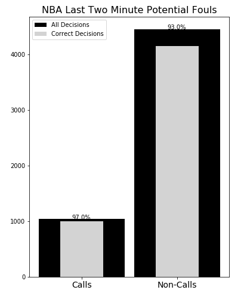

# l2m
NBA Last Two Minute Report exploration

## Results

### Fouls

This visualization is hard to believe, but a look into what constitutes a play being reviewed in the Last Two Minute reports is revealing. All whistles are assessed, which would cause the accuracy on calls to skyrocket. Why? As per the NBA:

`There must be clear and conclusive video evidence in order to make a determination that a play was incorrectly officiated`

The NBA is restricting the number of `IC` due to this high burden of proof. Whistles are presumed to be correct and must meet the above criteria to be overturned. Additionally, personal take fouls are considered, which are essentially fouls for which the defense _intentionally fouls_ the opponent. For these reasons, the accuracy of officials on calls is likely inflated.

Furthermore, non-calls also require this burden of proof, but non-calls are only considered for review when "notable" and:

`Notable non-calls will generally be defined as material plays directly related to the outcome of a possession`

First, the NBA has some discretion on which plays are considered here due to the inclusion of the word "generally" in the above. Because of this, the league can include or exclude calls to artificially boost accuracy and the performance on non-notable non-calls cannot be known from these reports. Second, officials are performing _worse_ on non-calls, which are, by definition, more material than the population of calls.

Let's take a look at turnovers

### Turnovers

Given the caveats above for these plays and the large number of plays deemed incorrectly officiated through technical support, it is no surprise that the accuracy on non-calls here is very low.
